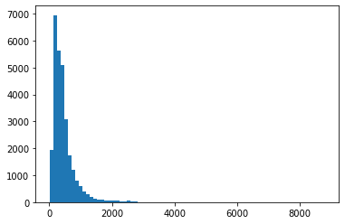
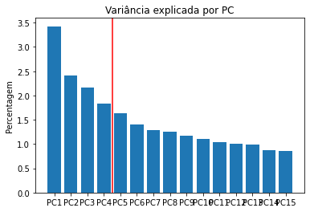
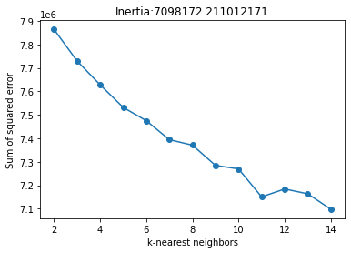
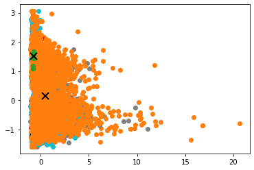
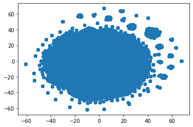
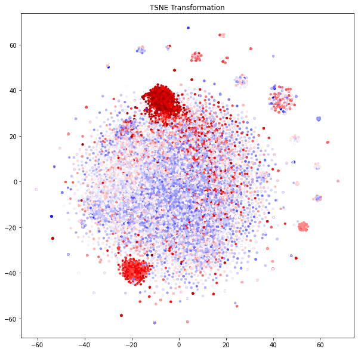

# Data Analysis using Machine Learning

This project consists in the analysis of dataset, through the use of machine learning algorithms, using Python as a programming language. This Jupyter Notebook is organized into sections, which include the steps of the analysis performed and explain very succinctly the procedures performed and decisions taken during the analysis.

## Table of contents

1. [Introduction](#chapter1)
    1. [About Us](#section1_1)
    2. [Data Selection and Context of this Project](#section1_2)
    3. [Credits](#section1_3)
2. [Initial Data Exploration and Preprocessing](#chapter2)
    1. [Importing Packages](#section2_1)
    2. [Importing datasets](#section2_2)
    3. [Exploring the data](#section2_3)
    4. [Protein Descriptors](#section2_4)
    5. [Preprocessing](#section2_5)
3. [Non-Supervised Analysis](#chapter3)
    1. [PCA](#section3_1)
    2. [Kmeans](#section3_2)
    3. [tSNE](#section3_3)
4. [Machine Learning](#chapter4)
    1. [Regression Analysis](#section4_1)
    2. [Binary Analysis](#section4_2)
5. [Deep Learning ](#chapter5)
6. [Conclusions](#chapter6)


<a class="anchor" id="chapter1"></a>

## 1. Introduction


<a class="anchor" id="section1_1"></a>

### 1.1 About Us


This project is part of the subject `Sistemas Inteligentes para a Bioinformática` in the Master in Bioinformatics (University of Minho - 2022/2023).

This project was developed by the following elements:
* Alexandre Miguel Magalhães Esperança - pg45963
* André Filipe Pereira da Silva - pg45462
* Mónica Rafaela Machado Leiras - pg45473


<a class="anchor" id="section1_2"></a>

### 1.2 Data Selection and Context of this Project

For the execution of this project, the dataset of the "Novozymes Enzyme Stability Prediction" Competition on the Kaggle platform was selected. You can view the [Competition and Corresponding Data here](https://www.kaggle.com/competitions/novozymes-enzyme-stability-prediction/data).

The main goal of this competition is to predict the thermostability of enzyme variants. The experimentally measured thermostability (melting temperature) data includes natural sequences, as well as engineered sequences with single or multiple mutations upon the natural sequences.

The test dataset contains experimental melting temperatures of over 2,413 single mutation variants of an enzyme (GenBank: KOC15878.1), obtained by Novozymes A/S. The wild-type amino acid sequence is:

    VPVNPEPDATSVENVALKTGSGDSQSDPIKADLEVKGQSALPFDVDCWAILCKGAPNVLQRVNEKTKNSNRDRSGANKGPFKDPQKWGIKALPPKNPSWSAQDFKSPEEYAFASSLQGGTNAILAPVNLASQNSQGGVLNGFYSANKVAQFDPSKPQQTKGTWFQITKFTGAAGPYCKALGSNDKSVCDKNKNIAGDWGFDPAKWAYQYDEKNNKFNYVGK


For this competition several files were given for the development of this work:

- `train.csv` - the training data, with columns as follows:
  - `seq_id`: unique identifier of each protein variants
  - `protein_sequence`: amino acid sequence of each protein variant. The stability (as measured by tm) of protein is determined by its protein sequence.
  - `pH`: the scale used to specify the acidity of an aqueous solution under which the stability of protein was measured. Stability of the same protein can change at different pH levels.
  - `data_source`: source where the data was published
  - `tm`: target column. Since only the spearman correlation will be used for the evaluation, the correct prediction of the relative order is more important than the absolute tm values. (Higher tm means the protein variant is more stable.)
- `train_updates_20220929.csv` - correction file for train dataset, where some rows have the values ​​of `pH` and `tm` switched, in addition to identifying lines with NaN values. For more details, you can check the [original explanation here](https://www.kaggle.com/competitions/novozymes-enzyme-stability-prediction/discussion/356251)

- `test.csv` - the test data; your task is to predict the target tm for each protein_sequence (indicated by a unique seq_id)

- `sample_submission.csv` - a sample submission file in the correct format, with seq_id values corresponding to test.csv

- `wildtype_structure_prediction_af2.pdb` - the 3 dimensional structure of the enzyme listed above, as predicted by AlphaFold


<a class="anchor" id="section1_3"></a>

### 1.3 Credits

To execute this project, we found some useful code and/or ideas on the forum of the competition. So, we would like to credit the following people with the corresponding notebooks:

[Luca Olga Sharp](https://www.kaggle.com/code/olgashevtsova/enzimes-stability-search-for-the-best-model)

[Alexander Chervov](https://www.kaggle.com/code/alexandervc/novozymes-eda1-ordinalencvisualizationscorrrelat)

[Chris Deotte](https://www.kaggle.com/code/cdeotte/train-data-contains-mutations-like-test-data)


<a class="anchor" id="chapter2"></a>

## 2. Initial Data Exploration and Preprocessing

This step corresponds to the following objectives:
- description and characterization of the assigned data according to the existing documentation/literature;
- brief description of the characteristics of the data available from the initial exploratory analysis;
- description of data preparation and pre-processing steps;
- initial exploratory graphs that illustrate the main characteristics of the data.

<a class="anchor" id="section2_1"></a>

### 2.1 Importing Required Packages

First, we imported the necessary packages. 
This can be observed in [this cell of the notebook]().


<a class="anchor" id="section2_2"></a>

### 2.2 Importing datasets

This step can be observed in [this cell of the notebook]().

To execute this project, we imported the train dataset named `train.csv`, and also the test dataset `test.csv` that we named `validation`.

```python
train.head()
```
<table border="1" class="dataframe">
  <thead>
    <tr style="text-align: right;">
      <th></th>
      <th>protein_sequence</th>
      <th>pH</th>
      <th>data_source</th>
      <th>tm</th>
    </tr>
    <tr>
      <th>seq_id</th>
      <th></th>
      <th></th>
      <th></th>
      <th></th>
    </tr>
  </thead>
  <tbody>
    <tr>
      <th>0</th>
      <td>AAAAKAAALALLGEAPEVVDIWLPAGWRQPFRVFRLERKGDGVLVG...</td>
      <td>7.0</td>
      <td>doi.org/10.1038/s41592-020-0801-4</td>
      <td>75.7</td>
    </tr>
    <tr>
      <th>1</th>
      <td>AAADGEPLHNEEERAGAGQVGRSLPQESEEQRTGSRPRRRRDLGSR...</td>
      <td>7.0</td>
      <td>doi.org/10.1038/s41592-020-0801-4</td>
      <td>50.5</td>
    </tr>
    <tr>
      <th>2</th>
      <td>AAAFSTPRATSYRILSSAGSGSTRADAPQVRRLHTTRDLLAKDYYA...</td>
      <td>7.0</td>
      <td>doi.org/10.1038/s41592-020-0801-4</td>
      <td>40.5</td>
    </tr>
    <tr>
      <th>3</th>
      <td>AAASGLRTAIPAQPLRHLLQPAPRPCLRPFGLLSVRAGSARRSGLL...</td>
      <td>7.0</td>
      <td>doi.org/10.1038/s41592-020-0801-4</td>
      <td>47.2</td>
    </tr>
    <tr>
      <th>4</th>
      <td>AAATKSGPRRQSQGASVRTFTPFYFLVEPVDTLSVRGSSVILNCSA...</td>
      <td>7.0</td>
      <td>doi.org/10.1038/s41592-020-0801-4</td>
      <td>49.5</td>
    </tr>
  </tbody>
</table>


```python
validation.head()
```


  <div id="df-362ffd6f-419b-477a-888c-2e838098ef9b">
    <div class="colab-df-container">
      <div>
<style scoped>
    .dataframe tbody tr th:only-of-type {
        vertical-align: middle;
    }

    .dataframe tbody tr th {
        vertical-align: top;
    }

    .dataframe thead th {
        text-align: right;
    }
</style>
<table border="1" class="dataframe">
  <thead>
    <tr style="text-align: right;">
      <th></th>
      <th>protein_sequence</th>
      <th>pH</th>
      <th>data_source</th>
    </tr>
    <tr>
      <th>seq_id</th>
      <th></th>
      <th></th>
      <th></th>
    </tr>
  </thead>
  <tbody>
    <tr>
      <th>31390</th>
      <td>VPVNPEPDATSVENVAEKTGSGDSQSDPIKADLEVKGQSALPFDVD...</td>
      <td>8</td>
      <td>Novozymes</td>
    </tr>
    <tr>
      <th>31391</th>
      <td>VPVNPEPDATSVENVAKKTGSGDSQSDPIKADLEVKGQSALPFDVD...</td>
      <td>8</td>
      <td>Novozymes</td>
    </tr>
    <tr>
      <th>31392</th>
      <td>VPVNPEPDATSVENVAKTGSGDSQSDPIKADLEVKGQSALPFDVDC...</td>
      <td>8</td>
      <td>Novozymes</td>
    </tr>
    <tr>
      <th>31393</th>
      <td>VPVNPEPDATSVENVALCTGSGDSQSDPIKADLEVKGQSALPFDVD...</td>
      <td>8</td>
      <td>Novozymes</td>
    </tr>
    <tr>
      <th>31394</th>
      <td>VPVNPEPDATSVENVALFTGSGDSQSDPIKADLEVKGQSALPFDVD...</td>
      <td>8</td>
      <td>Novozymes</td>
    </tr>
  </tbody>
</table>
</div>
      <button class="colab-df-convert" onclick="convertToInteractive('df-362ffd6f-419b-477a-888c-2e838098ef9b')"
              title="Convert this dataframe to an interactive table."
              style="display:none;">

  <svg xmlns="http://www.w3.org/2000/svg" height="24px"viewBox="0 0 24 24"
       width="24px">
    <path d="M0 0h24v24H0V0z" fill="none"/>
    <path d="M18.56 5.44l.94 2.06.94-2.06 2.06-.94-2.06-.94-.94-2.06-.94 2.06-2.06.94zm-11 1L8.5 8.5l.94-2.06 2.06-.94-2.06-.94L8.5 2.5l-.94 2.06-2.06.94zm10 10l.94 2.06.94-2.06 2.06-.94-2.06-.94-.94-2.06-.94 2.06-2.06.94z"/><path d="M17.41 7.96l-1.37-1.37c-.4-.4-.92-.59-1.43-.59-.52 0-1.04.2-1.43.59L10.3 9.45l-7.72 7.72c-.78.78-.78 2.05 0 2.83L4 21.41c.39.39.9.59 1.41.59.51 0 1.02-.2 1.41-.59l7.78-7.78 2.81-2.81c.8-.78.8-2.07 0-2.86zM5.41 20L4 18.59l7.72-7.72 1.47 1.35L5.41 20z"/>
  </svg>
      </button>


<a class="anchor" id="section2_3"></a>

### 2.3 Exploring the data

In this step, we explored the data available.
This can be observed in [this cell of the notebook]().

We observed that:

- `train` data is divided in 31390 samples and 4 features, corresponding to ~93% of total samples.
- `validation` data is divided in 2413 samples and 3 features, corresponding to ~7% of total samples.
- Labels for `train`: ['protein_sequence', 'pH', 'data_source', 'tm']
- the `validation` dataset corresponds to the test dataset for the competition scoring, so it misses the `tm` feature (the variable to be predicted).
- the `data_source` variable is not nominal, so we can't more information about this feature.
- the `pH` variable on the `train` dataset has a maximum value of 64.9.
- the `pH` variable on the `train` dataset has 31104 samples, while `tm` has 31390 (which is the total number of samples of that dataset).
- the `pH` variable on the `validation` dataset has all the samples with the same value of 8. 


#### Data sources

This step can be observed in [this cell of the notebook]().

We observed that 78% of the dataset corresponds to one unique data source.  

Although this feature (`data source`) is interesting to explore how the data was obtained, it contains a large number of null values (NA) and is not essential to the main goal of this project (**to predict `tm`**).
So, it was decided to drop this column from the dataset (presented further ahead).

#### Swap pH e tm (to correct data)

This step can be observed in [this cell of the notebook]().

Here it was possible to verify that the `pH` variable has errors in the `train` dataset, since its maximum is 64.9 (impossible pH value to obtain). According to the [source of the competition](https://www.kaggle.com/competitions/novozymes-enzyme-stability-prediction/discussion/356251), the variable `pH` and `tm` has some samples with the values swapped. Thus, it was necessary to change these values in the identified sequences (dataset `train_updates`).

#### Drop NA Values

This step can be observed in [this cell of the notebook]().

As said above, the column `data_source` will be eliminated from the dataset, as well as the rest of the samples with null values.


#### Summary

This step can be observed in [this cell of the notebook]().


Protein lenght distribution:



Summary about `train`:

```python
train.describe()
```

  <div id="df-d88faf8d-22c6-4343-9266-9509cb236143">
    <div class="colab-df-container">
      <div>
<style scoped>
    .dataframe tbody tr th:only-of-type {
        vertical-align: middle;
    }

    .dataframe tbody tr th {
        vertical-align: top;
    }

    .dataframe thead th {
        text-align: right;
    }
</style>
<table border="1" class="dataframe">
  <thead>
    <tr style="text-align: right;">
      <th></th>
      <th>pH</th>
      <th>tm</th>
    </tr>
  </thead>
  <tbody>
    <tr>
      <th>count</th>
      <td>28695.000000</td>
      <td>28695.000000</td>
    </tr>
    <tr>
      <th>mean</th>
      <td>6.872467</td>
      <td>51.385604</td>
    </tr>
    <tr>
      <th>std</th>
      <td>0.793184</td>
      <td>12.076609</td>
    </tr>
    <tr>
      <th>min</th>
      <td>1.990000</td>
      <td>25.100000</td>
    </tr>
    <tr>
      <th>25%</th>
      <td>7.000000</td>
      <td>43.700000</td>
    </tr>
    <tr>
      <th>50%</th>
      <td>7.000000</td>
      <td>48.800000</td>
    </tr>
    <tr>
      <th>75%</th>
      <td>7.000000</td>
      <td>54.600000</td>
    </tr>
    <tr>
      <th>max</th>
      <td>11.000000</td>
      <td>130.000000</td>
    </tr>
  </tbody>
</table>
</div>
      <button class="colab-df-convert" onclick="convertToInteractive('df-d88faf8d-22c6-4343-9266-9509cb236143')"
              title="Convert this dataframe to an interactive table."
              style="display:none;">

  <svg xmlns="http://www.w3.org/2000/svg" height="24px"viewBox="0 0 24 24"
       width="24px">
    <path d="M0 0h24v24H0V0z" fill="none"/>
    <path d="M18.56 5.44l.94 2.06.94-2.06 2.06-.94-2.06-.94-.94-2.06-.94 2.06-2.06.94zm-11 1L8.5 8.5l.94-2.06 2.06-.94-2.06-.94L8.5 2.5l-.94 2.06-2.06.94zm10 10l.94 2.06.94-2.06 2.06-.94-2.06-.94-.94-2.06-.94 2.06-2.06.94z"/><path d="M17.41 7.96l-1.37-1.37c-.4-.4-.92-.59-1.43-.59-.52 0-1.04.2-1.43.59L10.3 9.45l-7.72 7.72c-.78.78-.78 2.05 0 2.83L4 21.41c.39.39.9.59 1.41.59.51 0 1.02-.2 1.41-.59l7.78-7.78 2.81-2.81c.8-.78.8-2.07 0-2.86zM5.41 20L4 18.59l7.72-7.72 1.47 1.35L5.41 20z"/>
  </svg>
      </button>


- the `train` dataset without null values has a total of 28695 samples and only 3 features: `protein_sequence`, `pH` and `tm`.
- the `pH` feature has values between 1.9 and 11 but, the majority of samples have a pH value of 7.
- the `tm` feature has values between 25 and 130, but 50% of samples have a smaller range: 44-55.
- the `protein_sequence` samples have a large range of lenghts (between 5 and 8798), but 50% of samples have lenghts between 210 and 537). The mean lenght of the 28695 sequences is 451.
- to use some machine learning techniques it is needed to transform the feature `protein_sequence` into descriptors (multiple features). 

<a class="anchor" id="section2_4"></a>

### 2.4 Protein Descriptors

This step can be observed in [this cell of the notebook]().

As we only have two features to work with in the ML step, and one of them is the protein sequence, we need to extract from these sequences a set of descriptors.

Protein descriptors are quantitative measures that characterize various properties of a protein, such as its structure, stability, or function.

Here is a set of examples for these descriptors:

*   Sequence lenght (1 feature)
*   Amonoacid composition (20 features)
*   dipeptide composition (400 features)
*   tripeptide composition (8000 features)
*   Molecular weight (1 feature)
*   Aromaticity (1 feature)
*   Instability index ( 1 feature)
*   Isoeletric point (1 feature)

The only useful variable for this stage is the `protein_sequence`.
With this data, functions based on the `propy` and `biopython` packages were used:
- `calculate_dipeptide_composition`: DPC - dipeptide composition descriptors (400) for each protein. [propy package](https://pypi.org/project/propy3/)
- `calculate_molecular_weight`: Calculate MW from Protein sequence. [Biopython](https://biopython.org/docs/1.76/api/Bio.SeqUtils.ProtParam.html)
- `calculate_isoelectric_point`: Uses the module IsoelectricPoint to calculate the pI of a protein. [Biopython](https://biopython.org/docs/1.76/api/Bio.SeqUtils.ProtParam.html)
- `calculate_aromaticity`: Calculates the aromaticity value of a protein according to Lobry, 1994. It is simply the relative frequency of Phe+Trp+Tyr. [Biopython](https://biopython.org/docs/1.76/api/Bio.SeqUtils.ProtParam.html)
- `calculate_instability_index`: Implementation of the method of Guruprasad et al. 1990 to test a protein for stability. Any value above 40 means the protein is unstable. [Biopython](https://biopython.org/docs/1.76/api/Bio.SeqUtils.ProtParam.html)


With these fucntions, it was possible to extend the dataset to a total of 407 features.

Here it is possible to see a sample:


```python
train_dataset = train.join(di_dataframe)
train_dataset.sample()
```


  <div id="df-35347311-7893-4fb2-8199-0944e87064d1">
    <div class="colab-df-container">
      <div>
<style scoped>
    .dataframe tbody tr th:only-of-type {
        vertical-align: middle;
    }

    .dataframe tbody tr th {
        vertical-align: top;
    }

    .dataframe thead th {
        text-align: right;
    }
</style>
<table border="1" class="dataframe">
  <thead>
    <tr style="text-align: right;">
      <th></th>
      <th>protein_sequence</th>
      <th>pH</th>
      <th>tm</th>
      <th>molecular_weight</th>
      <th>isoelectric_point</th>
      <th>aromaticity</th>
      <th>instability_index</th>
      <th>AA</th>
      <th>AR</th>
      <th>AN</th>
      <th>...</th>
      <th>VL</th>
      <th>VK</th>
      <th>VM</th>
      <th>VF</th>
      <th>VP</th>
      <th>VS</th>
      <th>VT</th>
      <th>VW</th>
      <th>VY</th>
      <th>VV</th>
    </tr>
  </thead>
  <tbody>
    <tr>
      <th>1746</th>
      <td>GLTLGKSTDYRDTYDASLLQGVPRSLNRDPLGLKADNLPFHGTDIW...</td>
      <td>7.0</td>
      <td>54.0</td>
      <td>31284.6895</td>
      <td>5.641804</td>
      <td>0.103704</td>
      <td>22.241111</td>
      <td>0.0</td>
      <td>0.37</td>
      <td>0.0</td>
      <td>...</td>
      <td>0.0</td>
      <td>0.0</td>
      <td>0.0</td>
      <td>0.0</td>
      <td>0.74</td>
      <td>0.74</td>
      <td>0.0</td>
      <td>0.0</td>
      <td>0.37</td>
      <td>0.37</td>
    </tr>
  </tbody>
</table>
<p>1 rows × 407 columns</p>
</div>
      <button class="colab-df-convert" onclick="convertToInteractive('df-35347311-7893-4fb2-8199-0944e87064d1')"
              title="Convert this dataframe to an interactive table."
              style="display:none;">

  <svg xmlns="http://www.w3.org/2000/svg" height="24px"viewBox="0 0 24 24"
       width="24px">
    <path d="M0 0h24v24H0V0z" fill="none"/>
    <path d="M18.56 5.44l.94 2.06.94-2.06 2.06-.94-2.06-.94-.94-2.06-.94 2.06-2.06.94zm-11 1L8.5 8.5l.94-2.06 2.06-.94-2.06-.94L8.5 2.5l-.94 2.06-2.06.94zm10 10l.94 2.06.94-2.06 2.06-.94-2.06-.94-.94-2.06-.94 2.06-2.06.94z"/><path d="M17.41 7.96l-1.37-1.37c-.4-.4-.92-.59-1.43-.59-.52 0-1.04.2-1.43.59L10.3 9.45l-7.72 7.72c-.78.78-.78 2.05 0 2.83L4 21.41c.39.39.9.59 1.41.59.51 0 1.02-.2 1.41-.59l7.78-7.78 2.81-2.81c.8-.78.8-2.07 0-2.86zM5.41 20L4 18.59l7.72-7.72 1.47 1.35L5.41 20z"/>
  </svg>
      </button>


<a class="anchor" id="section2_5"></a>

### 2.5 Embedding

This step can be observed in [this cell of the notebook]().

An embedding is a relativly low dimensional space into which can be translated into a high-dimensional 
vectors. This type of preprocessing make it easier to do machine learning on large inputs like sparse vectors representing protein sequences.

#### SGT Embedding

This type of embedding embeds long patterns, in this case long protein patterns, into a finite dimension vector. The main advantage of SGT is that the long and short term patterns embedded in SGT can be tuned without any increase in the computation. [GitHub source](https://github.com/cran2367/sgt.git)


`kappa` --> Tuning parameter, kappa > 0, to change the extraction of long-term dependency. Higher the value the lesser the long-term dependency captured in the embedding. Typical values for kappa are 1, 5, 10.

`lengthsensitive` -->  Default false. This is set to true if the embedding of should have the information of the length of the sequence. If set to false then the embedding of two sequences with similar pattern but different lengths will be the same. lengthsensitive = false is similar to length-normalization.

Here, it is possible to see a sample:

```python
corpus.sample(1)
```

  <div id="df-6463a835-b10d-4c88-badb-341b1ec84555">
    <div class="colab-df-container">
      <div>
<style scoped>
    .dataframe tbody tr th:only-of-type {
        vertical-align: middle;
    }

    .dataframe tbody tr th {
        vertical-align: top;
    }

    .dataframe thead th {
        text-align: right;
    }
</style>
<table border="1" class="dataframe">
  <thead>
    <tr style="text-align: right;">
      <th></th>
      <th>id</th>
      <th>sequence</th>
    </tr>
    <tr>
      <th>seq_id</th>
      <th></th>
      <th></th>
    </tr>
  </thead>
  <tbody>
    <tr>
      <th>22237</th>
      <td>20120</td>
      <td>[M, R, P, H, R, A, F, S, P, G, L, T, G, V, L, ...</td>
    </tr>
  </tbody>
</table>
</div>
      <button class="colab-df-convert" onclick="convertToInteractive('df-6463a835-b10d-4c88-badb-341b1ec84555')"
              title="Convert this dataframe to an interactive table."
              style="display:none;">

  <svg xmlns="http://www.w3.org/2000/svg" height="24px"viewBox="0 0 24 24"
       width="24px">
    <path d="M0 0h24v24H0V0z" fill="none"/>
    <path d="M18.56 5.44l.94 2.06.94-2.06 2.06-.94-2.06-.94-.94-2.06-.94 2.06-2.06.94zm-11 1L8.5 8.5l.94-2.06 2.06-.94-2.06-.94L8.5 2.5l-.94 2.06-2.06.94zm10 10l.94 2.06.94-2.06 2.06-.94-2.06-.94-.94-2.06-.94 2.06-2.06.94z"/><path d="M17.41 7.96l-1.37-1.37c-.4-.4-.92-.59-1.43-.59-.52 0-1.04.2-1.43.59L10.3 9.45l-7.72 7.72c-.78.78-.78 2.05 0 2.83L4 21.41c.39.39.9.59 1.41.59.51 0 1.02-.2 1.41-.59l7.78-7.78 2.81-2.81c.8-.78.8-2.07 0-2.86zM5.41 20L4 18.59l7.72-7.72 1.47 1.35L5.41 20z"/>
  </svg>
      </button>


```python
embeddings.sample()
```

  <div id="df-97c28d98-8808-4355-9618-f954a905e7b3">
    <div class="colab-df-container">
      <div>
<style scoped>
    .dataframe tbody tr th:only-of-type {
        vertical-align: middle;
    }

    .dataframe tbody tr th {
        vertical-align: top;
    }

    .dataframe thead th {
        text-align: right;
    }
</style>
<table border="1" class="dataframe">
  <thead>
    <tr style="text-align: right;">
      <th></th>
      <th>id</th>
      <th>(A, A)</th>
      <th>(A, C)</th>
      <th>(A, D)</th>
      <th>(A, E)</th>
      <th>(A, F)</th>
      <th>(A, G)</th>
      <th>(A, H)</th>
      <th>(A, I)</th>
      <th>(A, K)</th>
      <th>...</th>
      <th>(Y, M)</th>
      <th>(Y, N)</th>
      <th>(Y, P)</th>
      <th>(Y, Q)</th>
      <th>(Y, R)</th>
      <th>(Y, S)</th>
      <th>(Y, T)</th>
      <th>(Y, V)</th>
      <th>(Y, W)</th>
      <th>(Y, Y)</th>
    </tr>
    <tr>
      <th>seq_id</th>
      <th></th>
      <th></th>
      <th></th>
      <th></th>
      <th></th>
      <th></th>
      <th></th>
      <th></th>
      <th></th>
      <th></th>
      <th></th>
      <th></th>
      <th></th>
      <th></th>
      <th></th>
      <th></th>
      <th></th>
      <th></th>
      <th></th>
      <th></th>
      <th></th>
    </tr>
  </thead>
  <tbody>
    <tr>
      <th>7765</th>
      <td>7491</td>
      <td>0.000214</td>
      <td>0.002607</td>
      <td>0.002735</td>
      <td>0.00325</td>
      <td>0.003435</td>
      <td>0.002003</td>
      <td>0.000308</td>
      <td>0.002719</td>
      <td>0.002741</td>
      <td>...</td>
      <td>0.000009</td>
      <td>0.00039</td>
      <td>0.003867</td>
      <td>2.933070e-07</td>
      <td>0.000143</td>
      <td>0.000006</td>
      <td>0.000257</td>
      <td>0.001749</td>
      <td>1.900573e-11</td>
      <td>1.053209e-21</td>
    </tr>
  </tbody>
</table>
<p>1 rows × 401 columns</p>
</div>
      <button class="colab-df-convert" onclick="convertToInteractive('df-97c28d98-8808-4355-9618-f954a905e7b3')"
              title="Convert this dataframe to an interactive table."
              style="display:none;">

  <svg xmlns="http://www.w3.org/2000/svg" height="24px"viewBox="0 0 24 24"
       width="24px">
    <path d="M0 0h24v24H0V0z" fill="none"/>
    <path d="M18.56 5.44l.94 2.06.94-2.06 2.06-.94-2.06-.94-.94-2.06-.94 2.06-2.06.94zm-11 1L8.5 8.5l.94-2.06 2.06-.94-2.06-.94L8.5 2.5l-.94 2.06-2.06.94zm10 10l.94 2.06.94-2.06 2.06-.94-2.06-.94-.94-2.06-.94 2.06-2.06.94z"/><path d="M17.41 7.96l-1.37-1.37c-.4-.4-.92-.59-1.43-.59-.52 0-1.04.2-1.43.59L10.3 9.45l-7.72 7.72c-.78.78-.78 2.05 0 2.83L4 21.41c.39.39.9.59 1.41.59.51 0 1.02-.2 1.41-.59l7.78-7.78 2.81-2.81c.8-.78.8-2.07 0-2.86zM5.41 20L4 18.59l7.72-7.72 1.47 1.35L5.41 20z"/>
  </svg>
      </button>


<a class="anchor" id="section2_6"></a>

### 2.6 Preprocessing

This step can be observed in [this cell of the notebook]().

Here, the `protein_sequence` column has been deleted, since it is a qualitative variable and cannot be used for data preprocessing. The `tm` column was also removed because it is the target variable that we want to predict in the following analysis.

To make the data internally consistent, it was standardized with the scale function of the sklearn package.

After standardizing the data, the dataset was divided into:
- train, with 70% of the samples
- test, with 30% of the samples

For this division, a permutation of the data was performed so that the data have a similar representation in the training and test dataset.

<a class="anchor" id="chapter3"></a>

## 3. Non-Supervised Analysis

This step can be observed in [this cell of the notebook]().

Unsupervised machine learning is a type of ML where we dont give any lables to the model. Instead, the model is only given input data and must find patterns or relationships in the data on its own. 

Some common unsupervised learning techniques include clustering and dimensionality reduction.

<a class="anchor" id="section3_1"></a>

### 3.1 PCA

Principal component analysis (PCA) serves as a dimentionality reduction method, often used to reduce dimensions of a large data sets, by transforming a large set of variables into a smaller one, reducing accuracy, but still contains most of the needed information.

1. Standardize the range of continuous initial variables (Previously done)
2. Compute the covariance matrix to identify correlations
3. Compute the eigenvectors and eigenvalues of the covariance matrix to identify the principal components
5. Recast the data along the principal components axes

It was made PCA for the dataset with and without the embeddings.


In here, it can be observed the results for PCA without embeddings:




In both cases, PCA doesn't return a significant explained variance. In each case, the explained variance ration is around 22% with the explained variance being higher in the embeddings.

We can conclude that PCA is not effective.


PCA results can be observed in [this cell of the notebook]().


<a class="anchor" id="section3_2"></a>

### 3.2 Kmeans

This step can be observed in [this cell of the notebook]().

K-Means is a unsupervised machine learning algorithm used to group data into clusters based on similarities.
The goal of K-means is to partition a dataset into a specified number of clusters (k) in a way that minimizes the within-cluster sum of squares. Here we present the following steps to run this algotithm:

1. Randomly selecting k initial centroids (points in the dataset that represent the center of the clusters)
2. Data point assigned to the cluster corresponding to the nearest centroid
3. The centroids are then updated to be the mean of the points in their respective clusters

This process is repeated until the centroids no longer change, or a maximum number of iterations is reached (In this case we set a maximum number of iterations)




    


As we can see, the graph shows in the top a high inertia, meaning a high sum of squared distances.
The quality of this clusters are low


### t-SNE

This step can be observed in [this cell of the notebook]().

t-SNE (t-Distributed Stochastic Neighbor Embedding) is used to project high-dimensional data into a lower-dimensional space, typically 2 or 3 dimensions.The goal is to preserve the pairwise distances between the data points in the lower-dimensional space as much as possible.

1. Compute pairwise affinities between all data points in the high-dimensional space.
2. Use these affinities to construct a probability distribution over the data points in the high-dimensional space.
3. Embed the data points in the low-dimensional space by minimizing the divergence between the two probability distributions (i.e., the one in the high-dimensional space and the one in the low-dimensional space).
4. Repeat steps 1-3 for a number of iterations until the embedding has stabilized.








Here we can see clusters with colors related to the thermostability of the proteins, the red ones are the ones with the highest stability index.


<a class="anchor" id="chapter4"></a>

## 4. Supervised Machine Learning

Supervised Machine Learning has the distinct characteristic of being trained on a labeled dataset. Hereon, the same training dataset of the unsupervised ML will be used with the correct output labeled.

<a class="anchor" id="section4_1"></a>

### 4.1 Regression Analysis

This step can be observed in [this cell of the notebook]().

The algorithm, through the recognition of patterns in the training data, will provide predictions in new unseen data. 

SupervisedModelOptimization class was built under the utils/models.py file and uses several useful Supervised Machine Learning models in regression problems, which represents our current task. This class allows the fit of predefined models with tuning of the possible important hyper-parameters variations, by fit_model() method. Finally, a prediction with the tuned and fitted model may be proceeded with the predict() method (check class documentation for further details).

It was pre-processed and verificated the mean and standard deviation of the train dataset.

Herewith, the class SupervisedModelOptimization splits the data automatically by a 0.3 proportion if no assigned test data. Accordingly, we have 20086 training samples and 8609 testing samples. 

```python
models = ["Linear Regression", "KNN", "Bagging",  "Random Forest", "Decision Tree"]
```

The models fit a list of models and then predicted with `test` dataset, calculating the following scores:

```python
for model, values in model_scores.items():
  predictions, score = values
  print(f"{model} obtained the following Mean Squared Error:\n\t{score}\n")
```

    Linear Regression obtained the following Mean Squared Error:
    	86.89232225984802
    
    KNN obtained the following Mean Squared Error:
    	80.75131050482923
    
    Bagging obtained the following Mean Squared Error:
    	86.16092449420108
    
    Random Forest obtained the following Mean Squared Error:
    	80.29840299718742
    
    Decision Tree obtained the following Mean Squared Error:
    	113.15933575996907
    

We verify that the Mean Squared Error (MSE) remained between 80 and 90 except for the Decision Tree Regressor, resulting in a 113 value error. 

Herewith, Supervised Machine Learning demonstrated better results than Unsupervised, but far from desired. Random Forest is the best model due to having the lowest MSE (80.298), using the following parameters:
    
    {n_estimators: 20, max_depth: 20, criterion: squared_error}.

It corresponds to the maximum number of estimators and depth attributed. Therefore, model improvement may occur with increased values in these parameters. However, the processing time increases immensely with the increased parameter values.

A possible way for better results may be increasing the cross-validation value, which remained at a value of 2, to reduce the processing model time.

Despite several attempts to run the Support Vector Regression model, it eventually got removed from the equation owing to running endlessly.


### 4.2. Binary Analysis

This step can be observed in [this cell of the notebook]().

In this section, we predicted the stability of a protein sequence. Protein sequences are stable if the Tm of a protein sequence is above 65◦C (Tm > 65◦C). Thus, a binary prediction through Logistic Regression will inform us of the relevant stable protein sequences. [Source Article here.](https://doi.org/10.1016/j.compbiolchem.2009.10.002)

We achieved an accuracy score of 93.3% and a Mean Squared Error (MSE) metric value of 0.258. Therefore, we can conclude that our protein stability prediction model has high fidelity for the prediction of whether or not a protein may be considered stable.


<a class="anchor" id="chapter5"></a>

## 5. Deep Learning

This step can be observed in [this cell of the notebook]().
